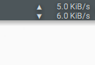

# plasma-applet-bandwidth-monitor

Plasma 5 widget that displays the currently used network bandwidth.

Based on the [Plasma 4 widget](http://kde-apps.org/content/show.php/netspeed-plasmoid?content=140504) created by Pinter Sandor.



## Installation
### From source

```bash
git clone https://github.com/Scrumplex/plasma-applet-bandwidth-monitor.git
cd plasma-applet-bandwidth-monitor
mkdir build
cd build
cmake ..
make
sudo make install
```

Dependencies:

* plasma-framework-devel
